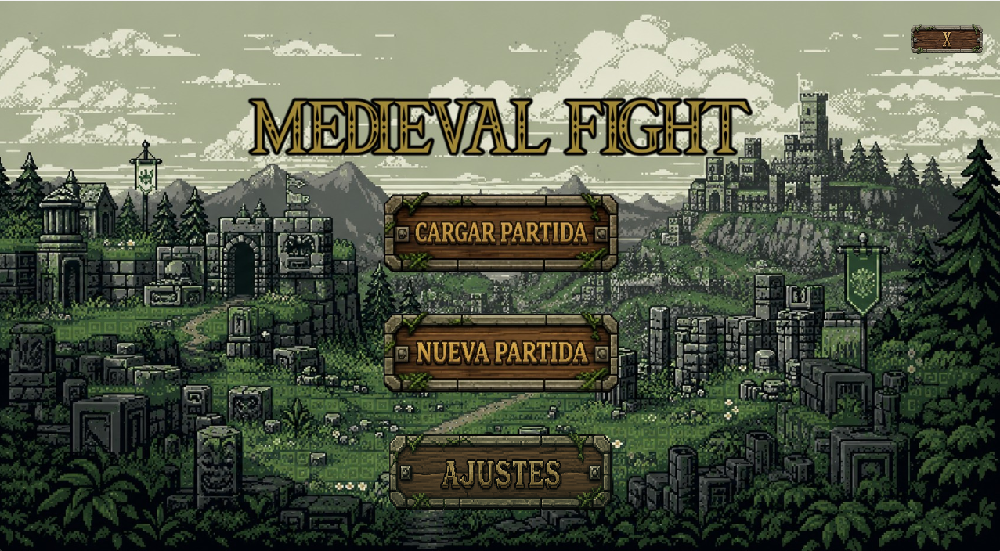
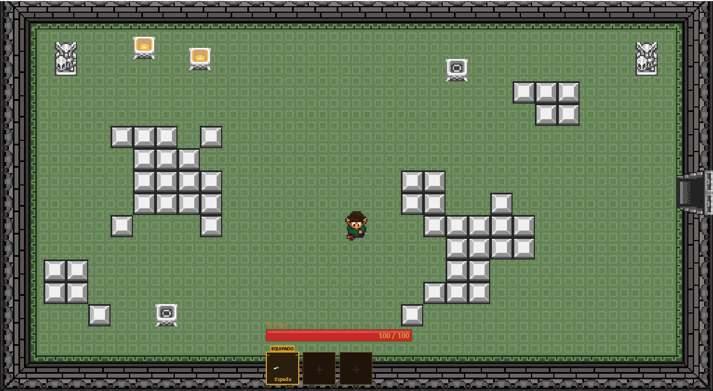
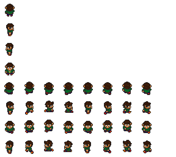
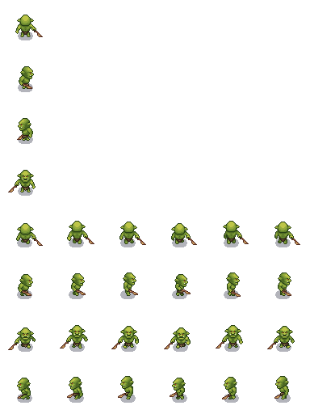
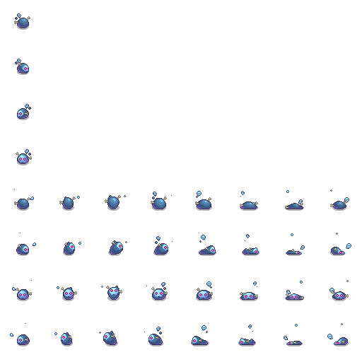
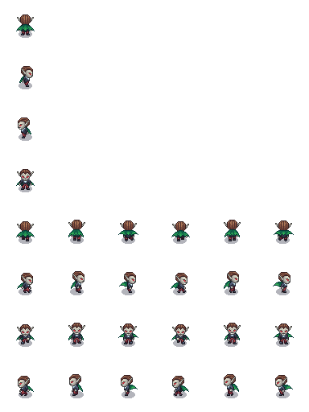
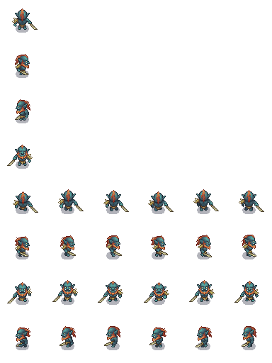
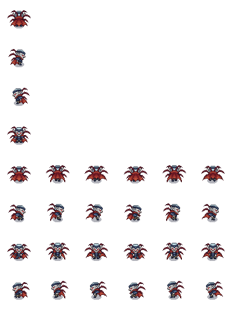
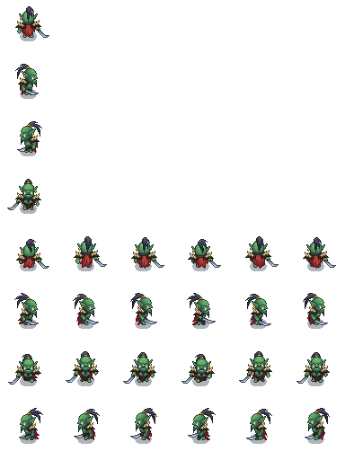

# Documento de Diseño — Medieval Fight

Medieval Fight consiste en un juego arcade al estilo de los juegos antiguos de The Legend of Zelda. Tiene un estilo retro y al mismo tiempo unas mecánicas de movimiento actuales, permitiendo al jugador moverse sin necesidad de una cuadrícula.

---

## Backstory

Viviremos la aventura de Chris, un guerrero de la tierra medieval que se encuentra atrapado en una mazmorra repleta de monstruos que buscan acabar con él. Su objetivo es avanzar a través de ella derrotándolos para escapar. Chris no recuerda nada de su vida pasada; sólo sabe que está en un lugar peligroso y que es imperativo que debe huir de allí.

A lo largo de su avance irá encontrando armas nuevas que le ayudarán en su huida.




---

## Desarrollo del juego

El juego se desarrolla dentro de mazmorras cerradas en las cuales el protagonista va a encontrar diferentes enemigos que van a tratar de derrotarlo para que no pueda escapar de la prisión.

Se compone de un total de 6 clases de enemigos. 3 de ellos son considerados enemigos normales (Enemigo1, Enemigo2 y Enemigo3), los cuales dependiendo del nivel de dificultad que se haya seleccionado (Fácil, Normal o Difícil) aparecerán en mayor o menor número para tratar de impedir el avance. Será estrictamente necesario derrotar a todos los enemigos presentes en una habitación para que las puertas se desbloqueen y permitan el paso a la siguiente sala.

Al superar los desafíos ordinarios, se le proporcionarán al protagonista nuevos objetos y recompensas que le ayudarán a superar las siguientes pruebas. Además de estos enemigos que a priori son más fáciles de superar, se encuentran los Bosses (Boss1, Boss2 y Boss3), únicos, significativamente más difíciles de vencer y equipados con una mayor cantidad de puntos de vida que el resto de los personajes.

---

## Estructura de salas

El juego se compone de 8 salas interconectadas. El jugador comienza en la Sala 0 y debe avanzar derrotando a los enemigos de cada habitación para desbloquear las puertas y acceder a las siguientes.

```
[Sala 0] → [Sala 1] → [Sala 2: Boss 1] → [Sala 3] → [Sala 4] → [Sala 5]
                                                       ↓            ↓
                                                [Sala 6: Boss 2] [Sala 7: Boss 3]
```

Las salas de Boss son obligatorias para completar el juego. Al derrotar al Boss 1 se desbloquea el Boomerang y al derrotar al Boss 2 se desbloquean las Bombas.



---

## Mecánicas del juego

Medieval Fight se basa en el avance a lo largo de una mazmorra. Para ello se ha implementado un inventario con objetos equipables entre los cuales el jugador puede elegir con cuál va a atacar.

### Objetos equipables

**Espada** — Arma cuerpo a cuerpo con la que el jugador comienza la partida. Hace daño moderado en un radio corto frente al jugador. Es el arma más rápida en cuanto a cooldown.

**Lanza** — Arma cuerpo a cuerpo de mayor alcance que la espada, aunque con un ataque más estrecho. Útil para golpear enemigos en línea recta sin acercarse demasiado.

**Boomerang** — Arma arrojadiza que viaja en línea recta y desaparece al colisionar con un enemigo o una pared. Hace más daño que la espada y proporciona la ventaja de la distancia. Se desbloquea al derrotar al Boss 1.

**Bomba** — Se planta en el suelo y explota al cabo de unos segundos, haciendo un gran daño en área a todos los enemigos cercanos. Es el arma más potente y por ello tiene el cooldown más largo. Se desbloquea al derrotar al Boss 2.


### Recuperación de vida

Al derrotar enemigos aparecerán corazones en el suelo en la posición donde cayeron. Al colisionar con ellos, el jugador recupera una pequeña cantidad de puntos de vida. La vida no puede superar el máximo.

### Puertas y progresión

Las puertas de cada sala permanecen bloqueadas mientras haya enemigos vivos. Una vez derrotados todos, las puertas se abren y el jugador puede avanzar a la siguiente habitación. Las salas completadas no vuelven a generar enemigos.

---

## Niveles de dificultad

Al comenzar una nueva partida el jugador puede elegir entre tres niveles de dificultad que afectan tanto a la cantidad de enemigos por sala como a sus estadísticas de vida, daño y velocidad de ataque.

| Dificultad | Enemigos por sala | Daño enemigos | Vida bosses |
|---|---|---|---|
| Fácil | Reducido | Bajo | Reducida |
| Normal | Estándar | Moderado | Estándar |
| Difícil | Elevado | Alto | Aumentada |

---

## Victoria y derrota

Para vencer en el juego es necesario derrotar a todos los enemigos de todas las salas, incluidos los tres Bosses. Al completarlo se muestra una pantalla de victoria con el tiempo empleado y la dificultad seleccionada.

De forma contraria, si los puntos de vida del jugador llegan a cero, el juego termina y se muestra la pantalla de Game Over, desde la que el jugador puede volver al menú principal.

---

## Estadísticas

### Jugador

| Atributo | Valor |
|---|---|
| Vida máxima | 100 |
| Velocidad | Moderada |

### Armas

| Arma | Daño | Cooldown | Alcance |
|---|---|---|---|
| Espada | 10 | 0.6 s | Corto (cuerpo a cuerpo) |
| Lanza | 20 | 0.8 s | Medio (cuerpo a cuerpo) |
| Boomerang | 25 | 1.0 s | Largo (proyectil) |
| Bomba | 60 (área) | 2.0 s | Área |

### Enemigos

| Enemigo | Vida | Daño | Velocidad |
|---|---|---|---|
| Enemigo 1 | 100 | 10 | Lenta |
| Enemigo 2 | 50 | 15 | Media |
| Enemigo 3 | 40 | 15 | Media |
| Boss 1 | 150* | 12* | Lenta |
| Boss 2 | 300* | 17* | Media |
| Boss 3 | 450* | 20* | Media-Alta |

*Valores en dificultad Normal. Varían según la dificultad seleccionada.

---

## Interfaz (HUD)

Durante la partida se muestra en la parte inferior de la pantalla:

**Barra de vida** — indica la vida actual del jugador sobre su máximo. Cambia de color según el estado: verde con vida alta, amarillo con vida media y rojo con vida baja.

**Inventario** — muestra los 5 slots de objetos disponibles. El objeto equipado aparece resaltado con una etiqueta "EQUIPADO". Los slots con cooldown activo muestran una cortina oscura que indica el tiempo restante.

Las puertas bloqueadas muestran un aviso en pantalla con el número de enemigos restantes en la sala.


---

## Pantallas del juego

**Menú principal** — permite iniciar una nueva partida, cargar una partida guardada, ajustar el volumen y salir del juego.

**Selección de dificultad** — pantalla previa al inicio de partida donde el jugador elige entre Fácil, Normal y Difícil.

**Pausa** — accesible con ESC durante la partida. Permite reanudar, guardar la partida o volver al menú principal.

**Game Over** — se muestra al morir. Permite volver al menú principal.

**Victoria** — se muestra al completar el juego. Muestra el tiempo empleado y la dificultad.

---

## Controles

Para el movimiento del jugador se utilizan las teclas W (arriba), S (abajo), A (izquierda) y D (derecha). Para seleccionar un arma del inventario se pueden utilizar las flechas del teclado, el scroll del ratón o los números del 1 al 5 para acceso directo. Para atacar con el objeto seleccionado se presiona la barra espaciadora. La tecla ESC pausa el juego y muestra un menú con distintas opciones.

| Tecla | Acción |
|---|---|
| W / A / S / D | Mover al personaje |
| SPACE | Usar arma equipada |
| 1 — 5 | Seleccionar objeto del inventario |
| ← → | Cambiar objeto equipado |
| Scroll ratón | Cambiar objeto equipado |
| ESC | Pausar el juego |

---

## Diseño de los personajes y recursos

Los sprites de los enemigos provienen de la cuenta https://free-game-assets.itch.io/, que permite el uso de sus spritesheets de forma gratuita.

Para los objetos y el tileset de los mapas se ha optado por un enfoque más tradicional y se han diseñado a mano, haciendo del proyecto algo más personal.

El personaje principal se ha diseñado desde cero, desde su concept art hasta sus sprites, que posteriormente han sido animados.

### Chris (personaje principal)




### Enemigos





### Bosses




---

## Sonido

El juego cuenta con música de fondo durante la partida con un estilo acorde al ambiente medieval de la mazmorra. El volumen es ajustable desde el menú principal.
