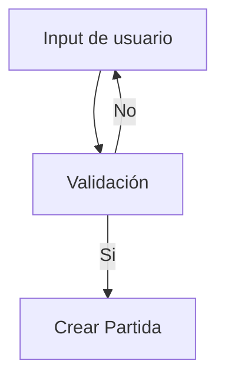

# Memoria del proyecto

  

## Vistas

Podemos estructurar nuestro videojuego a partir de vistas, en nuestro caso 8, las cuales se encuentran todas en la carpeta "views" y son las siguientes.

(Dejamos Game_view para el final ya que es la más relevante para el juego en si)

  

### Title (Titulo / Menú principal)

Esta es la primera pantalla que se lanza a la hora de ejecutar el juego, tratando de ser el centro de la navegación de las secciones del juego, luego al ser la primera impresión que se lleva el usuario queremos que sea la mejor posible. Aquí hemos desarrollado una GUI sencilla a partir de la librería de arcade arcade.GUI implementando una interfaz gráfica de usuario interactiva y visual adaptada a la estética del videojuego, al igual que el resto de vistas.

  

#### Diseño

Podemos diferenciar varios elementos:

-  **Fondo**: Textura que se renderiza cubriendo completamente el tamaño de la pantalla, aquóio veremos el título del juego.

-  **Botones**: Son botones con textura que, en lugar de utilizar los botones planos que nos proporciona la librería, nos ayudan a implementar las imágenes(generadas mediante Inteligencia Artificial)

-  **Música**: Hemos introducido música a la pantalla, diferente a la del resto del juego, que ayude a que el jugador se vaya incrustando en el ambiente.

  

#### Código y Componentes

Hemos hecho uso, como ya hemos dicho antes, de botones con Textura (```UITextureButton```)para poder mantener la estética y guiar que es lo que hace cada botón.

Estos botones son organizados verticalmente mediante un contenedor de tipo caja(````UIBoxLayout````), que a su vez es introducido en un sistema de anclaje (````UIAnchorLayout````) que permite centrar los componentes en la pantalla. Además, implementamos el método ````on_resize```` que hace que se pueda realizar el cambio de tamaño de la pantalla a través de que la proyección 2D se recalcule automáticamente y los elemento de la GUI se vuelvan a posicionar en la pantalla sin deformarse.

Todo esto es gestionado por un gestor de la GUI (``UIManager``) que limpia le buffer anterior para evitar que haya elementos duplicados en el caso de abrir la pantalla. Luego, a la hora de cerrarla, deshabilitamos al gestor para liberar recursos.

Para poder interactuar con los diferentes botones definimos diferentes eventos de clic que actúan como controladores de flujo, estos gestionan la transición a las pantallas de **ajustes**, **cargar partida** y **nueva partida**.

También debemos de comentar la gestión del audio. Lo que hacemos es interactuar directamente con el objeto global de la ventana (``self.window``)`comprobando que no haya ya una pista sonando a través de ``self.window.current_bgm_track`` y de ``self.window.bgm_player``. Si hay algo sonando lo quitamos y ponemos la música que deseamos para esta vista y sino lo ponemos directamente. Por otro lado, esta técnica nos ayudará a heredar propiedades que van a ser configuradas en otras vistas

  

### Setting (Ajustes)

La vista de ajustes proporciona la usuario poder modificar los parámetros del volumen de la música que va a sonar durante el juego y el tamaño en el que se va a encontrar la pantalla.

  

#### Diseño

Para ello podemos apreciar los mismos elementos que en la anterior vista además de un Slider que permite de manera interactiva y visual determinar el volumen de la música.

  

#### Código y componentes

Encontramos un ``UISlider`` que es el controlador del volumen. Al iniciarse la vista se realiza una lectura de la ventana (``self.window.bgm_player.volume``) para capturar el valor que desea el usuario y va a ser capturado por un evento "on_change" donde cualquier interacción del usuario con el slider va a ser plasmado en la propiedad del volumen al instante.

Por otro lado, el botón de pantalla completa interactúa directamente con la API del sistema a través del método ``self.window.set_fullscreen()``. Al cambiar el estado entre ventana y pantalla completa, forzamos la llamada a la función ``on_resize()``. Con esto aseguramos que la proyección 2D y las coordenadas del gestor de la interfaz se recalculen.

  

### Charge_game(Cargar Partida)

En esta vista, a partir de un sistema de gestión de guardado de partida proporcionaremos al usuario una biblioteca con las 5 últimas partidas que ha jugado, donde puede volver a donde lo ha dejado por el motivo que sea. Así, además, hemos implementado las competencias de gestión de ficheros que hemos aprendido en el curso.

Para ello hemos necesitado una función que ha guardado la información más importante de la partida, como la posición del personaje, la vida que tiene, la posición de los enemigos y su vida, los niveles pasados, etc., en un .json. Lo hemos guardado en formato JSON debido a su facilidad de a la hora de la depuración.

  

#### Arquitectura de la biblioteca de Partidas

Al iniciar la vista, a partir del módulo `os` buscamos en nuestra carpeta de partidas salvadas (`saves`) si tiene elementos. En el caso de que no haya archivos de partidas guardadas se lo avisamos al usuario a través de un mensaje por pantalla para que vuelva a la escena del título.

Por otro lado, en el caso de que si que haya partidas guardadas se mostrarán estas de menor a mayor tiempo de modificación (La que fue abierta más tarde aparecerá más abajo). Por otro lado, para que no haya mucha saturación de elementos y partidas hemos acotado el número de partidas totales guardadas a 5.

Una vez que se recuperan los datos de los ficheros estos se mostrarán con su nombre, el que hemos puesto a la hora de crear una nueva partida, en una botón con textura.

Vincularemos un evento "on_click" a cada uno de los botones de modo que se abrirá una partida tal cual la dejamos a la hora de guardar la partida. Para ello creamos una nueva vista Game_view y a la hora de inicializarla, como ya veremos más adelante, se reinstaurarán estos datos.

  

### New_game (Nueva partida)

Aquí se determinarán las características principales de la partida, es decir, que tan difícil queremos que sea la experiencia. Además, vamos a tener que determinar un nombre que va a ser determinante para la gestión de las partidas guardadas, por ello, para que un nombre sea válido comprobamos que no hay otra partida con el mismo nombre lo cual supondría problemas a la hora de cargarla.

  

#### Elementos

En este caso, al igual que en los anteriores hemos hecho uso de botones para guardar la dificultad que desee el usuario.

Por otro lado hemos empleado un cuadro de texto que guardará el nombre que inserte el usuario.

Finalmente, diferenciando también de las demás de vistas, hemos hecho uso de etiquetas de texto con una caligrafía acorde a nuestra estética descargada libre de derechos de autor. estás etiquetas lanzan un aviso en caso de que el nombre de partida ya haya sido usado y para guiar al jugador a interactuar con la GUI.

  

#### Código

Hemos hecho uso de ``UIInputText``, guardando su valor en un atributo de la propia clase para que al configurar todo comprobemos con ninguno de los JSON de las carpeta `saves`. En dicho caso lanzaremos un aviso para que se introduzca un nuevo nombre.

Se ha creado una función que simplemente cambia los botones de dificultad de tamaño en el caso de que haya sido creado, así el usuario sabe exactamente en que modo está jugando.

Finalmente, para atribuir estas características a la partida gestionamos todo a la hora de pulsar el botón __JUGAR__. Aquí primero, se hace la comprobación del nombre, en el caso de que sea correcto crearemos la partida y le insertaremos estos datos. Luego, como ya explicaremos más adelante, inicializaremos completamente todo el juego (haremos un `setup`) y se guardará en un JSON (que también se explicará más adelante)

  

#### Flujo de interacción



### Pause (Pausa denrto del juego)

Hemos considerado que debíamos de introducir una vista que sirva como descanso a la hora de jugar por si hay que ir al baño o, si las cosas no están yendo muy bien y no vamos a romper nuestro récord en el juego, reiniciar de 0 la partida.

  

#### Código

Esta vista es sin duda la que más componentes gráficos dispone, no obstante, alguno de ellos como el volumen está reciclado de otras vistas.

Tenemos que mencionar que, para la creación de esta vista, debemos de atribuir en el constructor el juego al completo, ya que lo vamos a necesitar en alguna que otra función, luego este atributo se va a guardar en la clase.

En el caso del botón de jugar, y el la flecha hacia atrás, deberemos de volver a enseñar la misma vista en la que estábamos a partir de ``self.window.show_view(self.game_view)``.

Por otro lado, si queremos reiniciar la partida con las misma dificultad y nombre que antes, por ello lo que hacemos es, primero, las habitaciones, de las que hablaremos más adelante, las pondremos todas como _no superadas_ y, luego, se creará una nueva partida reiniciando el tiempo de juego y dándole los nombres y dificultades pertinentes. Ejecutamos el ``setup()`` y guardamos de nuevo la partida por si era una partida que ya tenía cambios guardados.

  

## Elementos del juego

  

En esta sección se explicarán las mecánicas principales y las clases que componen el juego dentro de la vista principal `GameView`. A diferencia de los menús e interfaces estáticas, el entorno de juego requiere una gestión de físicas, mapas y una actualización de las entidades.

  

### Habitaciones

El juego se compone de un conjunto de salas que se encuentran en la clase `habitaciones.py`. Cada habitación (diseñada en Tiled) cuenta con una estructura con un tamaño de 64x64 píxeles (`TILE_SIZE = 64`).

  

Las paredes, límites de la mazmorra y colisiones estructurales se almacenan en una lista de sprites (`self.wall_list`). Los márgenes funcionales de la sala se calculan restando el tamaño del tile a la resolución por defecto ($1280  \times  704$), delimitando así el área de movimiento seguro para las entidades.

  

Cada instancia de habitación posee una lista de objetos tipo `Door` orientados en el norte, sur, este u oeste. El script comprueba si existen enemigos vivos en la sala mediante `len(self.enemy_list) > 0`.

  

Si quedan enemigos, las puertas ejecutan el método `_draw_door_highlight` para que el jugador no pueda salir de la sala.

  

Al morir el último enemigo, las colisiones de las puertas se inhabilitan, permitiendo al jugador avanzar a la sala adyacente, lo que dispara un refresco de la escena y recoloca al personaje en el extremo opuesto (`OPUESTO`) del mapa.

  

### Entidades (Player y Enemy)

El jugador (`Player`) se mueve por el mapa detectando las pulsaciones del teclado establecidas `GameView` mediante booleanos (`up_pressed`, `down_pressed`, etc.). Su vector de velocidad se actualiza en el método `actualizar_movimiento`. Cuenta con un atributo de velocidad constante fijado en `5.05` y un radio de colisión de `20` píxeles.
 

La lista `self.enemy_list` abarca los tipos de enemigos existentes:

Los enemigos ordinarios (Enemigo 1, 2 y 3), los cuales poseen algoritmos de persecución básicos que calculan la distancia respecto al `center_x` y `center_y` del jugador para desplazarse hacia él. Su tasa de aparición se pondera mediante la variable `dificultad`.
  

Los bosses (Boss 1, 2 y 3), los cuales son un tipo de enemigo que posee más puntos de vida y un mayor ataque, suponiendo un mayor desafío al jugador.
  

### Motor de Físicas y Bucle de Actualización (`on_update`)
  

### Mecánicas de Combate y Armamento
Las mecánicas de combate que hemos decidido implementar se basan en la obtención de objetos (items) que facilitan el avance en el juego. Estos objetos se obtienen al derrotar a los distintos jefes (bosses), quienes se encuentran en salas solos y poseen mucha más vida que los enemigos comunes. Los objetos añadidos son:
- <u>Espada:</u> La espada es el objeto básico con el que el jugador empieza la partida. Posee un daño base reducido y es complicado atacar a los enemigos con el, pues siempre hay un riesgo alto de perder vida combatiendo a distancia corta.
- <u>Boomerang:</u> El boomerang es un objeto arrojadizo que daña a larga distancia, su daño no es de otro mundo, pero facilita el combate contra los enemigos al poder crear una distancia con ellos.
- <u>Bombas:</u> Las bombas son el arma más llamativa. Se despliegan en el suelo y al poco tiempo explotan. Son muy útiles a la hora de hacer mucho daño a enemigos usando la técnica de soltar la bomba y huir. Son el último objeto que el jugador puede obtener y por ello es el más potente.
  
 Como añadido, al derrotar a enemigos comunes estos soltarán un corazón si estas fuera de su hitbox en el momento de eliminarles. Estos corazones restauran 10 puntos de vida y pueden resultar muy útiles a lo largo de la partida.

## Integrantes del equipo

Ahora vamos a enumerar cada una de las tareas que ha llevado a cabo cada uno de los integrantes del equipo, así como algunos comentarios sobre los aspectos que han sido más complicados de llevar y que es lo que más han disfrutado del proyecto.

Consideramos que no hemos llevado una línea fija en un solo área de trabajo sino que hemos tratado de aportar ideas todos en cada uno de los aspectos de este videojuego acorde a las necesidades que tenía el mismo y debido al abandono total de interés por parte de uno de los integrantes del grupo. No obstante creemos que hemos podido llevar a cabo un buen trabajo y que seguro que va a ser disfrutado por el usuario.

### Pablo Lafuente Llorente

#### Tareas realizadas

- Gestión de guardado y exportación de datos en JSON
- Desarrollo de vistas:
	- Game_over
	- New_game
	- Winner_view
	- Pause_view
	- Charge_game

#### Aspectos más complicados

Personalmente

### Marcos Serrano García

#### Tareas realizadas
- Diseño del tileset.
- Diseño de los personajes (basados en los de https://free-game-assets.itch.io/)
- Creación de los spritesheets de los personajes y objetos así como el concept art del jugador.
- Implementación de las animaciones de los personajes y objetos.
- Implementación de los objetos bomba y boomerang.
- Terminar la implementación de la espada.
- Implementación de los corazones.

#### Aspectos más complicados
Por mi parte, lo más complicado a sido la creación de tanto spritesheets como de concept art. Estas han 
sido tareas que han tomado mucho tiempo, además de recursos, para poder tenerlas de forma presentable.

### Daniel Viana Cascón

#### Tareas realizadas

- Diseño y creación de habitaciones.
- Desarrollo del movimiento de los enemigos.
- Desarrollo de vistas:
	- Title_view
	- Setting_view

#### Aspectos más complicados

En mi caso, lo más difícil ha sido la creación del modo de pantalla completa en la vista de ajustes, principalmente debido a todos los problemas que conlleva el cambio de resolución de pantalla. Sin embargo, creo que he conseguido afrontarlos de manera eficiente.